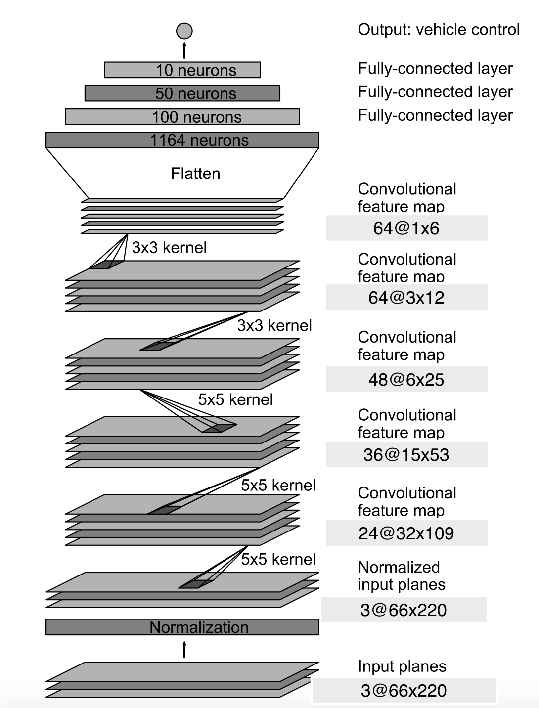

# Self-Driving Car Engineer Nanodegree
# Deep Learning
## Project: Behavioral cloning

### Overview
This is the 3rd project of the <a href="https://www.udacity.com/course/self-driving-car-engineer-nanodegree--nd013">Self Driving Car Engineer Nanodegree</a>I am taking part. <br>
The aim of this project was to build a Deep Neural Network to clone my driving behavior while driving a car around a circuit (in a simulator). The car is equipped with virtuals cameras on the hood, the left and right of it. While driving, the simulator records the 3 images, as well as the corresponding steering angle. The nework is then feed by theses datas, and train to predict the steering angle of a given cameras. 
By doing that, the Network is then able to drive the car itself around the circuit. 

### Data collection
The simulator is provided with a <i>training mode</i> allowing us to record data while driving the car around the track. The issue here is that I was only able to use a keyboard to drive the car, which caused a lot of noise. The Udacity team has been king enough to provide us a clean dataset. <br/>
A row from the dataset (<i>driving_log.csv</i>) contains the path of the left, right and center images mapped with the steering angle.<br/>
<center></center>
Regarding the left and right images, we need to change the original steering angle. The basic idea here is to find the angle which would be necessary to apply to the steering wheel to be centered on the image, starting from the left or right image. <br>
An example of the different point of view recorded by the cameras can be found below.
  

### Data pre-processing and augmentation
<ul>
	<li><b>Split the driving_log.csv</b></li> 
	The <i>driving_log.csv</i> contains 3 images for one steering angle. Its shape is then `(nb_rows, 6)`. I transformed it to have only the path of the image mapped with the corresponding angle (adapted if left or right image). The new shape is then `(3*nb_rows, 2)`. <br/> <br/>
	<li><b>Scale down</b></li> 
	All of the the image is not neccesary to predict the angle. I only need to see the road, as well as the sides of the road. Besides, I needed to scale down the images to fit the input shape of my Deep Neural Network. The original image is of shape `(160, 320, 3)`, which I will scale down to (`66, 220, 3`). Here, 66 is the height of the image, 220 the width and 3 the channel. 
	It is also important to notice that scaling down the image allow less computation. <br/> <br/>
	<li><b>Brightness</b></li> 
	I apply a random brightness to the image. This in order to train the model on images captured from different lighting condition.<br/> <br/>
	<li><b>4. Flipping</b></li> 
	The track contains a lot more left turns than right turns. This induces a bias to the left and the model may not behave well because of this. Indeed, it might not know how to turn to the right since there are very few pictures with a right turn. To counter-balance this, I flip the center image 50% of the time while training. Of course the angle is inversed. 
</ul>


### Deep Neural Network architecture
I have decided to follow the architecture described in this excellent [paper](https://arxiv.org/pdf/1604.07316v1.pdf) from Nvidia.
Here, make sense to use Convolutional Layer, because they are very efficient at recognizing shapes. I also add some Droput layers to avoid over-fitting


### Workflow and use of AWS
I use Amazon AWS for the computation part (g2.2xlarge instance). <br>
Once the computation done, I tested it locally and if the results was better than the previous one, the branch was merded to the master. 

### Encountered issue
<b>Architecture</b> <br>
	I struggled fo a long time (almost 2 weeks) before choosing the right architecture for my Deep Neural Network.
	My first try was the following: 

        ```python
        model.add(Convolution2D(32, 3, 3, input_shape=(32, 64, 3), border_mode="same", activation='relu'))
        model.add(Convolution2D(64, 3, 3, subsample=(3, 3), border_mode="same", activation='relu'))
        model.add(Dropout(0.5))
        model.add(Convolution2D(128, 3, 3, subsample=(3, 3), border_mode="same", activation='relu'))
        model.add(Convolution2D(256, 3, 3, subsample=(3, 3), border_mode="same", activation='relu'))
        model.add(Dropout(0.5))
        model.add(Flatten())
        model.add(Dense(1024, activation='relu'))
        model.add(Dense(512, activation='relu'))
        model.add(Dense(128, activation='relu'))
        model.add(Dense(1))
        ```
	
	Which did not work out well. I then try to add some more layers: 
	
		```python
		model.add(Convolution2D(32, 3, 3, input_shape=(16, 32, 3), border_mode="same", activation='relu'))
		model.add(Convolution2D(32, 3, 3, subsample=(1, 1), border_mode="same", activation='relu'))
		model.add(Convolution2D(64, 3, 3, subsample=(3, 3), border_mode="same", activation='relu'))
		model.add(Convolution2D(64, 3, 3, subsample=(1, 1), border_mode="same", activation='relu'))
		model.add(Convolution2D(128, 3, 3, subsample=(3, 3), border_mode="same", activation='relu'))
		model.add(Convolution2D(128, 3, 3, subsample=(1, 1), border_mode="same", activation='relu'))
		model.add(Convolution2D(256, 3, 3, subsample=(3, 3), border_mode="same", activation='relu'))
		model.add(Convolution2D(256, 3, 3, subsample=(1, 1), border_mode="same", activation='relu'))
		model.add(Flatten())
		model.add(Dense(1024, activation='relu'))
		model.add(Dense(512, activation='relu'))
		model.add(Dense(128, activation='relu'))
		model.add(Dense(1))
		```

	That did not work well either. <br>
	I then decided to use the open source work from [commai](https://github.com/commaai/research/blob/master/train_steering_model.py) which **did** give way better results, but not good enough in my case. I finally adopted the architecture described above. <br/> <br/>
	
<b>Angle</b> <br>
	Fine tuning the angle to compensate the original one from the left and right images was also a difficult task. It was not possible to compute it manually and it was a game of guessing. <br>
	At one point, I decided to test only on center images, as you can see in this [branch](https://github.com/Mornor/CarND-Behavioral-cloning/tree/only_center), but I didn't have enough data. I then recorded myself **recovery data** and it helped the model to behave in a better way but again, it was not sufficient to complete the whole track. <br>
	I decided to continue to work with left and righ images.

### Conclusion
This project was without a doubt the most difficult so far. I started to work on it the 31st of December and finished it the 13rd of January. Overall, I spent 4 hours a week day  on it, and almost all my week-ends. <br>
It has been a rewarding work, and I can finally say that <b>the car is able to drive by itself.<b> 